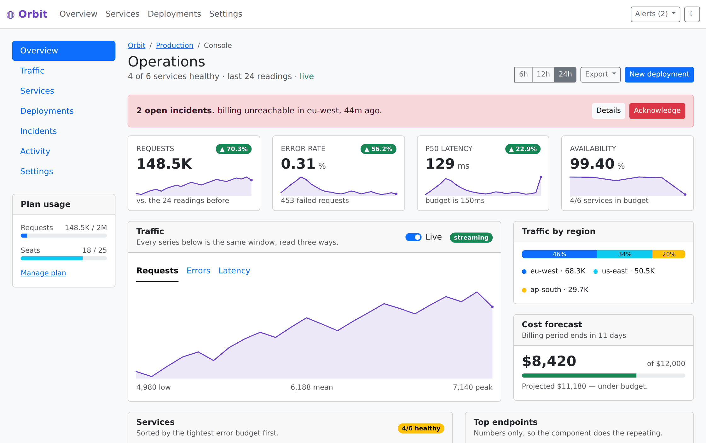

# Markout

[](https://github.com/fcapolini/markout/actions/workflows/build.yml)
[](https://github.com/fcapolini/markout/actions/workflows/test.yml)
[](https://github.com/fcapolini/markout/actions/workflows/coverage.yml)
[](https://github.com/fcapolini/markout/actions/workflows/codeql.yml)

[Website](https://markout.dev) ·
[Live demos](https://markout.dev/demos/) ·
[Docs](docs/) ·
[Benchmark](packages/cli/bench/) ·
[VS Code extension](packages/vscode/)

Markout is an HTML extension that adds **modularity**, **reactivity** and
**isomorphism** to plain HTML. It is not an application framework.
Framework-shaped features live in *kits*, written in Markout itself rather
than built into the language. You can use the ones that ship, the
[standard kit](kits/std-kit/) and [`bootstrap-kit`](kits/bootstrap-kit/)
(Bootstrap 5.3 as components), or write your own.

<picture>
  <source media="(prefers-color-scheme: dark)" srcset="assets/orbit-dark.png">
  
</picture>

[**Orbit**](https://markout.dev/demos/orbit.html) is an operations console demo
written in Markout + bootstrap-kit, over a directory of JSON files and no back end. Its
numbers are fetched while the page renders, so every one of them is in the
HTML that arrives and the browser asks for nothing, as can be seen in its source.
[Its source](sites/site/demos/orbit.html) · [all the demos](https://markout.dev/demos/)

The page stays HTML. Anything without a `${...}` or a `:` is plain markup and
stays plain markup, so adopting Markout means adding an attribute to a page
you already have, and you can stop at any point. What it buys is the two
things a static page cannot do for itself: recurring markup becomes a tag you
name once, and the page keeps itself in step with its own data.

Markout is the presentation layer, and only that. The DOM is the view, your
application's data is the model, and Markout is the logic between them:
deriving what is shown from what is true, and folding what a user does back
into data. In the vocabulary of model-view-presenter it is the presenter,
written declaratively rather than as imperative view-pushing. A page's model
is whatever values it declares, plus whatever a datasource fetches:
`std-data` in the [standard kit](kits/std-kit/), which is a component rather
than a language feature.

## Reactivity, in the page itself

```html
<html :count=${0} :light=${true}>
  <head>
    <style>
      body {
        color: ${light ? 'black' : 'white'};
        background-color: ${light ? 'white' : 'black'};
      }
    </style>
  </head>
  <body>
    <button :on-click=${() => count++}>
      Clicked ${count} time${count !== 1 ? 's' : ''}
    </button>
    <button :on-click=${() => light = !light}>
      Switch theme
    </button>
  </body>
</html>
```

## Design philosophy

The objective is to remove as much needless complexity as possible from
reactive web development. The whole language is a handful of rules:

- HTML is the syntax. Anything without a `${...}` or a `:` is plain markup
  and stays plain markup.
- `${...}` is the only expression syntax — plain JavaScript, in text,
  attributes and CSS, with no separate expression language to learn.
  Anything holding one is reactive, so `href=${data.link}` needs no
  further marking.
- `:` names what HTML has no name for, always in the same `:family-name`
  shape: `:class-`, `:style-`, `:attr-`, `:prop-`, `:on-`, `:did-`/`:will-`,
  `:for-`, `:handle-`, `:server-`, `:slot` — plus `:name=${...}` to declare a
  value, `:const-name` to declare one the compiler works out and drops, and `:aka`
  to name a scope.
- `::name` is the one mark that is about a name rather than a value: a
  component's **interface**. A `<:define>` declares its parameters with it
  and a usage site passes them with it, which is what tells "this is for the
  component" from "this is mine" at a glance — see [a usage site is a call,
  and an element](docs/reference/syntax.md#a-usage-site-is-a-call-and-an-element).
- A **modifier** is not a family. `:const-` and `:server-` mark an ordinary
  value rather than naming something in another world, so neither is part of
  what that value is *called*: `:const-accent` is read as plain `${accent}`.
  Which is what lets a page take a kit's constant and make it live by
  declaring that name plainly — the kit goes on writing `${accent}`, and
  only the page that asked for a binding pays for one.
- `class+=` and `class-=` — and `style+=`, `style-=` — contribute to an
  attribute instead of replacing it, and are not `:` names for the reason
  the rest are: `:` names what HTML has no name for, and `class` has a name.
  What is new is the **operation**. Only those two attributes have them,
  being the two HTML gives a *set* rather than a value; a literal is read
  the way HTML spells that attribute, an expression carries the value
  itself.
- A few directives take a reserved word rather than a prefix — `:if`,
  `:else-if`, `:else` — and can, because a value has to be something an
  expression can say: `${if}` does not parse, so no page could ever have
  declared one by that name. A word you could not have used is a word a
  directive can take with no prefix and no possibility of collision.
- Scopes nest lexically, like variables: a value is visible to every
  descendant with no separate wiring — no `provide`/`inject`, no `Context`.
- An expression resolves where it was *written*. A custom tag's body sees
  the scope it was defined in; what you pass at a usage site sees yours.
  That is what lets a component be moved without its meaning changing — and
  a usage site can hold state of its own, `:count=${0}` on a `<my-row>`
  meaning exactly what it means on a `<span>`.
- Two intents get two spellings rather than one guessing from the shape of
  a value: `title=${v}` sets an attribute's value, `:attr-title=${v}` sets
  whether it is there at all.

The full syntax is a single page: **[syntax
reference](docs/reference/syntax.md)**. The reasoning behind each part is in
**[docs/](docs/)**.

Compare that to what's required to be productive in most other frameworks
(hooks and dependency arrays, `computed` vs `watch`, whole directive sets,
dependency injection, change detection, ...): the goal is for this list to
stay short.

No rule above has a "convenient" exception (e.g. `class`/`style` silently
merging instead of overriding when re-assigned — `class=` replaces
everywhere, and adding is the other spelling rather than the same one
behaving differently in context — or a callback attribute accepting a bare
expression sometimes and requiring a function other times). A shortcut that only saves a few characters at the call site but
requires every future reader to remember a special case isn't a
simplification, it's deferred, compounding complexity: better to always
type a couple more characters than to hide behavior that depends on
context.

## Source level modularity

```html
<!-- lib.htm -->
<lib :light=${true}>

  <style>
    body {
      color: ${light ? 'black' : 'white'};
      background-color: ${light ? 'white' : 'black'};
    }

    .theme-switcher {
      font-size: bold;
    }
  </style>

  <:define tag="theme-switcher:button"
    :class-theme-switcher
    :on-click=${() => head.light = !head.light}>
    Switch theme
  </:define>
</lib>
```

```html
<html>
  <head>
    <:import src="lib.htm" />
  </head>
  <body>
    <theme-switcher />
  </body>
</html>
```

NOTE: root level attributes in imported fragments (`*.htm` files) are applied to `<:import>`'s container tag unless they are already defined there: this allows defaults and override.

NOTE: `<html>`, `<head>`, and `<body>` always have their own scopes and by default they are named `page`, `head`, and `body` respectively: that's why, combined with NOTE above, `head.light = !head.light` works

NOTE: `:class-` prefixes "class attributes", which dynamically add/remove a CSS class name depending on their value (if a value is unspecified as in this example, it's taken as `true`)

NOTE: `<:import>` is only allowed in page `<head>` (or recursively in imported fragments), so imported fragments can rely on their root attributes being available as `head` scope values

## Componentization

Reactivity aside, `<:define>` alone is enough to turn recurring markup into
a tag: no build step, no component base class, no separate file format —
a fragment of HTML, given a name.

[`demos/bootstrap/index.html`](sites/site/demos/bootstrap/index.html) and
[`demos/bootstrap/index-plain.html`](sites/site/demos/bootstrap/index-plain.html) render
the same page, and almost all of the difference between them is in the first
35 lines. Plain Bootstrap needs 5 lines of `<head>` boilerplate (charset,
viewport, CDN links with their integrity hashes) and 22 lines of navbar
(nested `nav > div > ul > li > a`, a toggler button, `data-bs-target` matched
by hand to the collapse `id`, four ARIA attributes). With a kit of Markout
fragments, the same thing is:

```html
<head>
  <:import src="/npm/@markout-lang/bootstrap-kit/all.htm" />
  <title>Northstar Studio | Product Design for Growing Teams</title>
</head>

<body>
  <bs-navbar ::items=${[
    { name: 'Services', link: '#services' },
    { name: 'Our work', link: '#work' },
    { name: 'Insights', link: '#insights' },
    { name: 'Start a project', link: '#contact', button: true },
  ]}>
    Northstar Studio
  </bs-navbar>
```

The markup that was only ever mechanical becomes data. The pinned Bootstrap
version, the integrity hashes, the toggler/collapse `id` wiring and the
accessibility attributes are written once in
[`@markout-lang/bootstrap-kit`](kits/bootstrap-kit/) and can't drift from page to
page. The kit is an installed package here, which is what `/npm/` in the
import says — see [npm kits](docs/design/npm-kits.md); a kit vendored into
the docroot is imported by its path instead.

NOTE: the kit itself is plain HTML too — see
[`parts/navbar.htm`](kits/bootstrap-kit/parts/navbar.htm), where the `<li>` is
the original Bootstrap one with `:for-each=${items}` and a few
`:class-x=${...}` attributes added; there's no component API to learn
beyond the rules above

NOTE: the toggler/collapse wiring is built from `$id`, so each `<bs-navbar>`
gets ids of its own — the reason a component carrying internal `id`/`aria-*`
references can be used more than once on a page at all

NOTE: fragments compose — `all.htm` imports `parts/base.htm` and
`parts/navbar.htm` — and importing the whole kit is the ordinary thing to
do, because a definition no tag on the page uses is dropped before the page
is served. Importing all of `bootstrap-kit` and using one component serves
4.7KB where the same page with that pass turned off is 19.8KB, and 134 bytes
more than importing the one part by hand. Markup only: a definition's scope
was never in the props, so those are the same size either way

NOTE: since a custom tag is just a tag, the rest of the page stays plain
HTML: you lift out what is boilerplate and leave your content alone, rather
than rewriting the page into a template language

## Conditionals

```html
<html :n=${0}>
  <body>
    <p :if=${n === 0}>nothing yet</p>
    <p :else-if=${n === 1}>one thing</p>
    <p :else>${n} things</p>
  </body>
</html>
```

`:if` is plain truthiness, so `${count}` and `${name}` mean what they look
like. `:else-if` and `:else` continue it, on the element immediately after —
the chain shows the first branch whose condition holds and no other, which
two `:if`s cannot do, since the branch that has to give up its position is
the one whose own condition did not change.

Nothing inside a branch that isn't showing is evaluated, which is what makes
`${user.name}` safe to write in one. And the element is parked in a
`<template>` rather than rebuilt, so a scroll position, a focused input or a
playing video survives a round trip.

## Replication

```html
<html>
  <body>
    <ul :for-each=${[[1, 2, 3], [4, 5]]}>
      <li :for-each=${data}>
        Item ${data}
      </li>
    </ul>
  </body>
</html>
```

NOTE: `:for-` prefixes anything related to replication/optional data, a
shared namespace for `:for-each`/`:for-as`/`:for-key`/`:for-data`

NOTE: by default the bound value is named `data` (`:for-as` can change that)

NOTE: `:for-each` treats `null`/`undefined` as zero elements (nothing is
rendered) and otherwise expects an iterable; it never guesses at a scalar
meaning "one", since that would make its meaning depend on the incidental
shape of the value rather than being one fixed rule

## Optional rendering

```html
<html :user=${undefined}>
  <body>
    <p :for-data=${user}>Welcome, ${data.name}</p>
  </body>
</html>
```

`:for-data=${expr}` renders its tag once if `expr` is neither `null` nor
`undefined`, and not at all otherwise — the same `data`/`:for-as` binding as
`:for-each`, but for an optional single item rather than a list.

It is the same arity as `:if` asked a different question, and the difference
is the point. `:for-data` is `!= null`, so `0` and `''` are data — right for
an item, wrong for a condition — and it binds what it found. Use `:for-data`
when there is something to show, and `:if` when there is something to decide.

That is also why `:for-each` doesn't quietly accept a non-iterable and render
it once: two intents, two attributes, rather than one inferring which you
meant from the shape of the value.

The body doesn't evaluate while there is nothing to show, which is the point
rather than an optimisation — `${data.name}` above has to be safe to write.
And the element itself is moved rather than rebuilt, so whatever the DOM was
holding survives a round trip.

## A value's whole life on one element

```html
<html>
  <body>
    <:logic :aka="timer"
      :count=${0}
      :_timer=${null}
      :did-init=${() => _timer = setInterval(() => count++, 100)}
      :will-dispose=${() => clearInterval(_timer)} />
    <div>Ticks ${timer.count}</div>
  </body>
</html>
```

`:did-init` and `:will-dispose` are the two ends of a scope's life, and the
pair is what lets a value that needs starting and stopping say so where it is
declared rather than in a lifecycle method somewhere else.

NOTE: `<:logic>` is a scope with no element of its own. State that belongs to
the page rather than to anything on it had to invent a `<span>` to live on
before this existed — and that `<span>` is then real: in the document, in the
accessibility tree, and in the way of `:first-child`

NOTE: `:_timer` is private by convention, not by rule — a leading underscore
is how the kits mark a value that is the component's own business

NOTE: the other two moments are `:did-attach` and `:will-detach`, which fire
as markup enters and leaves the page rather than as the scope is built and
destroyed — the pair a region that comes and goes needs

## If you're already reaching for Alpine or htmx

These are the tools a page usually picks up when it needs behavior, so here
is the honest comparison rather than one that flatters us.

| | Alpine.js | htmx | Markout |
| --- | --- | --- | --- |
| Behavior written in HTML attributes | yes | yes | yes |
| What it needs to run | a `<script>` tag | a `<script>` tag | Node serving the page, or a build step |
| Mistakes caught before the page loads | no, silent at runtime | n/a | yes, with a file and a line |
| Content present in the served HTML | no, `x-cloak` hides the gap | yes, the server wrote it | yes, served or prerendered |
| Same source renders on the server | no, client only | server owns the HTML | yes |
| Reusable components in markup | no — `x-data` reuses behavior; markup comes from the server | server-side partials | `<:define>` + `<:slot>` |
| Parametric CSS | inline styles, or CSS variables set inline | whatever the server renders | `${...}` inside `<style>` |
| Interaction without a server round-trip | yes | no, by design | yes |

And the costs, which are real: Alpine's ecosystem, community and
documentation are far larger, and it is a mature project. It also asks for
strictly less to get started — one `<script>` tag, on any host, behind any
backend — where Markout wants Node in the request path or a build step. htmx
is solving a different problem, server-driven UI, and composes fine with
either.

Two rows are worth the trade, if any are. A mistake in an Alpine attribute is
silent until someone loads the page and notices; here it is a compile error
naming the file and the line, in the terminal or in the editor. And a
reusable piece of UI is split in Alpine — its markup belongs to whatever
renders the page, its behavior to `Alpine.data()` — where `<:define>` keeps
both together, in the page's own language.

Speed is deliberately not a row in that table. There is a benchmark — [the
catalog benchmark](packages/cli/bench/README.md) runs the same app in
Markout, Alpine, React, Svelte and Vue, and measures how fast it updates,
what it weighs over the wire and in memory, and when its content first
appears — but it is an optimization tool for us, not an official ranking of
anybody. It is one app, at four sizes, on one machine, written by the
people who wrote one of the five entrants. We keep it to find out which
columns Markout needs work in, and those are the columns worth your
attention there.

## Two decisions, not one

This is the argument for why you are on a CSS framework in the first place,
rather than an argument about what to use for logic. Choosing a framework
today usually settles a second question at the same time: which UI components
you get to use. Ant Design and MUI mean React,
Vuetify means Vue, PrimeNG means Angular. Teams routinely adopt a framework
they have no particular opinion about because the component library they
need exists only there — and from then on neither decision can be revisited
without the other.

Those are separable concerns. A CSS framework is a markup convention; a web
component library is a set of custom elements. Neither needs a framework at
all. What they need is a way to pass values in, set properties that aren't
strings, and listen to events — which is what `:attr-x`, `:prop-x` and
`:on-x` are. (It's also why React needed wrapper packages to consume custom
elements for most of its life.)

So Markout wrapped around Bootstrap, Tailwind or Shoelace keeps both choices
open: change how the page is put together without touching the components,
or change the components without touching the logic.

NOTE: the honest cost — the framework-neutral component ecosystem is
smaller and shallower than React's. Decoupling buys freedom at the price of
reach, and that trade is only worth it if the components you need exist

## Three ways to deliver a page

A compiled page is one artifact, and it runs in two places, so there is more
than one way to put it in front of a visitor. Which one you pick decides how
much of the page arrives already rendered — not how it is written.

**Served by Node**, with the CLI below or the Express middleware. The render
runs per request, so the page can read what a request has: `:server-` values
run on the server, and a datasource fetches before the page is serialized. The
visitor gets finished HTML that then comes alive. This is the isomorphic mode,
and it is the one that makes SSR come for free.

**Prerendered** with `markout prerender`, for a project served by Rails,
Django, Laravel, PHP, or a bucket behind a CDN. Markout becomes a build step
rather than something in your request path, and what ships is plain HTML and
JavaScript. This is not "client-side rendering": the same render pass runs
once, at build time, so the markup is in the file and a page's static content
does not flash in after JavaScript loads. What it cannot carry is what a
request would have supplied — a `:server-` value has no result, and a
datasource needs `::client` so the browser fetches it on arrival.

**Built** with `markout build`, which compiles and stops there. Values resolve
in the browser, the way any client-side framework does it, and the artifact
asks nothing of the world around it: no server, no reachable backend, nothing
to have up when the build runs. A page whose data comes from an API fetches it
on arrival rather than shipping a copy that was true once.

The difference between the last two is worth stating plainly, because it is a
trade and not a ranking. `prerender` buys content-in-the-markup at the price
of needing whatever the page fetches reachable from the build machine, and of
freezing that moment's answer into the artifact. `build` gives that up and
needs nothing.
[Isomorphism](docs/concepts/isomorphism.md#three-ways-to-deliver-a-page) has the
details.

The two ahead-of-time modes are what let the server-rendered majority of
projects adopt Markout without moving off the stack they already run.

## CLI

Serve a directory of Markout HTML files:

```sh
npm i -g @markout-lang/cli
markout ./site
```

Name the directory `markout/` and there is nothing to type at all: `markout`
serves it, and `markout build` compiles it into `dist/` beside it.

`markout add <kit>` fetches a kit and pins it, and `markout restore` fetches
what a clone is missing — both without npm, for the case below and for CI.
Everything else — building for a host that isn't Node, mounting the
middleware in an application that has its own routes, and the error pages
both modes serve — is in **[running a page](docs/reference/cli.md)**.

## Editor support

[`markout-vscode`](packages/vscode/) puts the compiler in the editor: the
same diagnostics the CLI reports, on the right line, without saving — for
every page in the workspace, not only the ones that are open. With go to
definition on a name, a custom tag or an `<:import>` path; completion of
what is in scope, the tags a kit defines and the parameters one takes;
hover, rename and find-references across the pages and fragments a name
actually reaches; and formatting that knows a `>` inside `${...}` does not
end a tag.

The compiler and the server are both bundled, so all of that works on a
project that has installed nothing — and so does the **Markout view** the
extension puts in the activity bar: the kits this project uses, each a
checkbox, with Preview and Build beside them. That is the next section.

## Without Node at all

The language is pitched at people who write HTML — designers who code,
backend developers with a templating layer they would rather not have, anyone
maintaining a server-rendered application. Most of them have no Node, and
none of them want any.

So the editor extension does not ask for one. Install it, open a folder of
HTML, and:

- **Tick a kit** and it is fetched and pinned. No npm: a kit is `.htm` and
  CSS, fetched over HTTPS and checked against the checksum the registry
  published. It lands in `.markout/kits/`, which the compiler resolves as
  one more rung on the walk it already does — so `markout build` in a
  terminal, a teammate's checkout and CI all read the same tree.
- **Press Preview** and the pages are served, live, reloading as you save.
  It runs on the copy of Node your editor is already running, so nothing
  looks for `node` on a PATH and nothing has to be there.
- **Press Build** and the finished site is written to `dist/`.

`.markout/kits.json` pins exact versions, so two clones build the same thing,
and an update is offered rather than applied. `markout restore` is what a
clone or a CI job runs to fill in the files, which is the one command the
whole arrangement needs from a terminal — and it needs Node only on the
machine that runs it, which does not have to be yours.

What this mode delivers is the third of the three above: pages that render in
the browser. Prerendered and served delivery are Node executing your page, so
they stay a terminal's job. [Working without
Node](docs/design/without-node.md) is why it is shaped this way, and
[the sidebar](docs/reference/vscode-extension-sidebar.md) is the page for
somebody using it.

## How it's built

A TypeScript monorepo on npm workspaces, MIT licensed.

| | |
| --- | --- |
| [`packages/core`](packages/core/) | the compiler and the client runtime — HTML in, a scope tree with every name resolved out, plus the payload of expressions and their dependency lists that a page comes alive from |
| [`packages/cli`](packages/cli/) | `markout <dir>` to serve, `markout build <dir> <out>` to compile ahead of time |
| [`packages/express`](packages/express/) | the same render as middleware, for an application that has its own routes |
| [`packages/vscode`](packages/vscode/) | the editor integration, and the view that installs kits, previews and builds |
| [`kits/`](kits/) | `bootstrap-kit` (every component on Bootstrap's 5.3 cheatsheet, one file each) and `std-kit`, both written in Markout rather than in TypeScript |
| [`sites/site`](sites/site/) | markout.dev and its demos, written in Markout and served by the Express package |

2,696 tests across 134 files, with coverage and CodeQL on every push.

Three decisions, rather than the rest of the inventory:

**One compiler, four ways to run it.** The dev server, the Express
middleware, `markout build` and the editor all run the same `Compiler`. The
editor is the interesting one: `readFile` is a parameter of the compiler so
the language server can hand it the buffer instead of the file, which is why
every diagnostic in VS Code is the compiler's own and
[`packages/vscode/src/diagnostics.ts`](packages/vscode/src/diagnostics.ts)
re-implements no rule. What you get, in the terminal or on the line you are
typing, names a file, a line and a column:

```
/parts/ui.htm:323:5: Unknown reference: "URLSearchParams"
```

**A value that crosses from the server is settled before the page is.** A
`:server-` value is a promise the render waits on and serialises the result
of, so a page arrives complete rather than arriving and then filling in. A
*rejected* one fails the build instead of shipping a page with a hole in it,
because such a value crosses frozen and the browser has no way to retry it —
[value transfer](docs/design/value-transfer.md) has the reasoning, and
[silent failures](docs/design/silent-failures.md) has the standard the rest
of the compiler is held to.

**A page pays for what it uses.** The compiled output is the rendered markup
plus one payload of expressions and their dependencies; a page with nothing
reactive on it ships no runtime at all.

Markout is in production on [ubimate.com](https://ubimate.com), which is
where the sharp edges get found.
