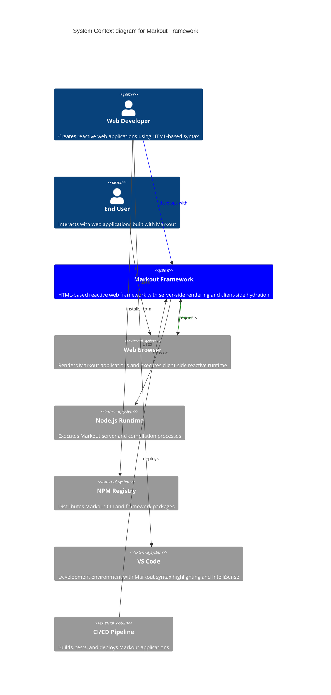

# Level 1: System Context Diagram

This diagram shows how the Markout framework fits into the broader ecosystem and its relationships with external systems and users.

## Key Relationships

### Developer Interactions
- **Development**: Developers write applications using Markout's HTML-based syntax with reactive `:attributes` and `${expressions}`
- **Tooling**: Integration with VS Code provides syntax highlighting, IntelliSense, and development support
- **Package Management**: CLI and framework distributed through NPM registry

### Runtime Interactions  
- **Server-Side**: Markout runs on Node.js, compiling and pre-rendering pages
- **Client-Side**: Browser receives pre-rendered HTML with embedded reactive runtime
- **Hydration**: Client-side runtime takes over from server-rendered state seamlessly

### Deployment Pipeline
- **CI/CD Integration**: Automated building, testing, and deployment of Markout applications
- **Production**: PM2 process management with clustering and health monitoring

## External Dependencies

- **Node.js 18+**: Required runtime environment with modern JavaScript features
- **Express.js**: Web server framework and middleware system
- **Modern Browsers**: Support for Proxy, ES6+, and standard DOM APIs
- **Build Tools**: esbuild for fast TypeScript compilation and bundling