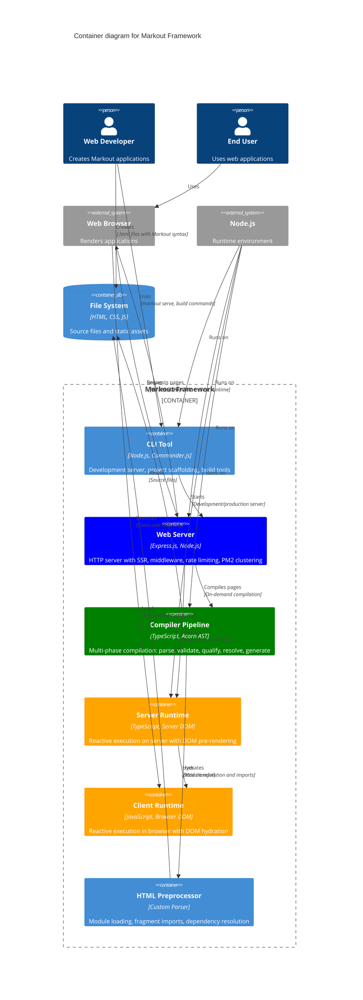

# Level 2: Container Diagram

This diagram shows the major containers that make up the Markout framework and how they interact.

## Container Responsibilities

### CLI Tool
- **Development Server**: Hot-reload development environment with live compilation
- **Production Management**: PM2 integration, clustering, health monitoring  
- **Project Scaffolding**: Templates for different project types (Bootstrap, Shoelace, minimal)
- **Build Tools**: Static site generation, PWA builds, bundle analysis

### Web Server (Express.js)
- **HTTP Server**: Request handling with middleware pipeline
- **Server-Side Rendering**: Pre-rendering pages with reactive logic
- **Static Assets**: Serving CSS, JS, images with compression
- **Rate Limiting**: DoS protection and API throttling
- **Process Management**: PM2 clustering, graceful shutdown, health checks

### Compiler Pipeline
- **Multi-Phase Compilation**: Load → Validate → Qualify → Resolve → Treeshake → Generate
- **AST Analysis**: JavaScript expression parsing and transformation using Acorn
- **Dependency Resolution**: Building reactive value dependency graphs
- **Code Generation**: Converting to executable BaseScopeProps structures
- **Optimization**: Dead code elimination and scope hierarchy optimization

### HTML Preprocessor  
- **Module Loading**: Fragment imports with `<:import>` directive
- **Dependency Resolution**: Automatic deduplication and loading order
- **Syntax Support**: `:attributes` and `${expressions}` in HTML
- **Component System**: `<:define>` for reusable components

### Server Runtime
- **Reactive Execution**: BaseContext/BaseScope/BaseValue system on server
- **DOM Pre-rendering**: Server-side DOM with HTML generation
- **State Preparation**: Preparing state for client-side hydration
- **Performance**: Batched updates and dependency tracking

### Client Runtime
- **DOM Hydration**: Taking over from server-rendered state
- **Reactive Updates**: Real-time DOM updates based on state changes
- **Event Handling**: User interaction processing
- **State Management**: Client-side reactive state with browser APIs

## Technology Stack

- **Languages**: TypeScript (server), JavaScript (client)
- **Runtime**: Node.js 18+ with Express.js framework
- **Compilation**: Acorn (AST), esbuild (bundling), custom HTML parser
- **Process Management**: PM2 with clustering and monitoring
- **Testing**: Vitest with comprehensive coverage (178+ tests)
- **Build System**: npm scripts with cross-platform compatibility