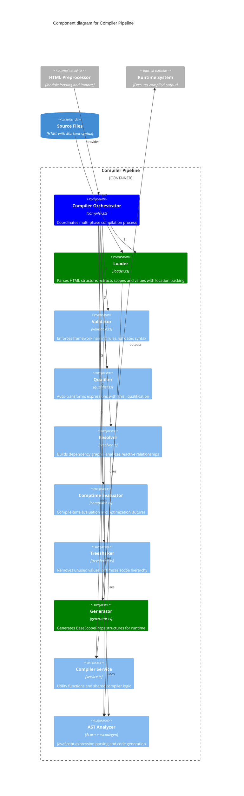

# Level 3: Compiler Pipeline Components

This diagram shows the components within the Compiler Pipeline container and their interactions.

## Phase-by-Phase Breakdown

### Phase 1: Loader
- **HTML Parsing**: Converts HTML with Markout syntax into structured data
- **Scope Extraction**: Identifies reactive scopes based on `:attributes`
- **Value Identification**: Finds reactive values in `${expressions}`
- **Location Tracking**: Maintains source location information for debugging
- **Output**: Initial scope/value structure with metadata

### Phase 2: Validator  
- **Naming Rules**: Enforces `$` reserved namespace (forbidden in user identifiers)
- **Syntax Validation**: Validates `:attribute` syntax and `${expression}` format
- **Framework Constraints**: Ensures compliance with Markout conventions
- **Error Reporting**: Detailed error messages with source location
- **Output**: Validated structure ready for transformation

### Phase 3: Qualifier
- **Expression Transformation**: Auto-adds `this.` qualification to expressions
- **Lexical Scoping**: Ensures proper variable resolution in reactive system
- **AST Manipulation**: Uses Acorn parser and escodegen for reliable transformation
- **Scope Context**: Maintains awareness of nested scope hierarchy
- **Output**: Qualified expressions ready for dependency analysis

### Phase 4: Resolver
- **Dependency Graph**: Builds reactive value dependency relationships
- **Reference Analysis**: Identifies which values depend on which other values  
- **Circular Detection**: Prevents circular dependency issues
- **Update Order**: Determines optimal order for reactive updates
- **Output**: Complete dependency graph for runtime optimization

### Phase 5: Comptime (Future)
- **Compile-time Evaluation**: Evaluates expressions that can be resolved at build time
- **Static Optimization**: Pre-computes constant values and expressions
- **Bundle Size Reduction**: Eliminates runtime computation where possible
- **Output**: Optimized expressions with static values resolved

### Phase 6: Treeshaker
- **Dead Code Elimination**: Removes unused reactive values and scopes
- **Scope Optimization**: Flattens unnecessary scope hierarchy
- **Dependency Pruning**: Removes unused dependency relationships
- **Size Optimization**: Reduces runtime memory footprint
- **Output**: Minimal scope structure with only necessary components

### Phase 7: Generator
- **BaseScopeProps Generation**: Converts analyzed structure to runtime format
- **Code Generation**: Uses escodegen for reliable JavaScript output
- **Runtime Compatibility**: Ensures output works with BaseContext/BaseScope system
- **Metadata Preservation**: Maintains debugging and development information
- **Output**: Executable BaseScopeProps ready for runtime instantiation

## Supporting Components

### AST Analyzer (Acorn + escodegen)
- **JavaScript Parsing**: Reliable parsing of expressions within HTML
- **Code Transformation**: Safe modification of JavaScript AST
- **Code Generation**: Clean, readable JavaScript output
- **Source Maps**: Maintains connection between input and output (future)

### Compiler Service
- **Utility Functions**: Shared logic across compiler phases
- **Error Handling**: Consistent error reporting and recovery
- **Configuration**: Compiler options and settings management
- **Caching**: Compilation result caching for performance

## Error Handling & Recovery

- **Phase Isolation**: Errors in one phase don't crash entire compilation
- **Detailed Reporting**: Source location, context, and suggestions
- **Graceful Degradation**: Partial compilation when possible
- **Development Mode**: Enhanced error reporting for debugging