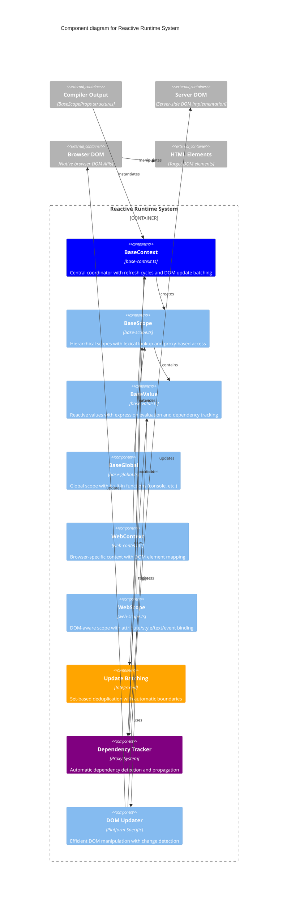

# Level 3: Reactive Runtime Components

This diagram shows the components within the Reactive Runtime System and their interactions.

## Core Runtime Components

### BaseContext - Central Coordinator
- **Refresh Cycles**: Manages reactive update cycles with `refreshLevel` tracking
- **Update Batching**: Coordinates batched DOM updates using Set-based deduplication
- **Scope Management**: Creates and manages hierarchical scope relationships
- **Polymorphic Support**: Works identically on server and browser environments
- **Performance**: Automatic batching prevents redundant DOM operations

**Key Methods:**
- `refresh()`: Triggers reactive update cycle
- `createScope()`: Instantiates new reactive scopes
- `addPendingUpdate()`: Queues DOM updates for batching

### BaseScope - Hierarchical Scopes
- **Lexical Lookup**: Variable resolution following JavaScript scoping rules
- **Proxy Access**: Transparent reactive access to scope variables
- **Parent Chain**: Hierarchical parent-child scope relationships
- **Value Management**: Creates and manages reactive values within scope
- **Inheritance**: Child scopes inherit from parent scopes naturally

**Key Features:**
- `$parent` access for parent scope variables
- `$value()` method for reactive value creation
- Automatic `this.` qualification for expression evaluation
- Proxy-based transparent variable access

### BaseValue - Reactive Values
- **Expression Evaluation**: Executes reactive expressions in scope context
- **Dependency Tracking**: Automatically tracks which values depend on others
- **Change Propagation**: Triggers updates when dependencies change
- **Lazy Evaluation**: Only evaluates when value is actually needed
- **Error Handling**: Graceful handling of evaluation errors

**Reactive Lifecycle:**
1. Expression parsed and stored
2. Dependencies tracked on first evaluation
3. Value cached until dependencies change
4. Automatic re-evaluation on dependency updates

## Advanced Runtime Features

### Update Batching System
- **Set-based Deduplication**: Uses JavaScript Set to automatically deduplicate updates
- **Automatic Boundaries**: Batching tied to refresh cycle boundaries (`refreshLevel === 0`)
- **Cross-scope Batching**: Updates from multiple scopes batched together
- **Performance Optimization**: Prevents redundant DOM operations during rapid state changes
- **Transparent Operation**: Works without requiring code changes

**Batching Flow:**
1. Multiple `value.set()` calls add to pending Set
2. `context.refresh()` processes entire pending Set
3. Set automatically deduplicates identical updates
4. DOM updated once per unique change

### Dependency Tracking System
- **Proxy-based Detection**: Automatically detects variable access during evaluation
- **Bidirectional Relationships**: Tracks both dependencies and dependents
- **Circular Prevention**: Detects and prevents circular dependency issues
- **Propagation Chains**: Efficiently propagates changes through dependency tree
- **Memory Management**: Cleans up unused dependency relationships

### DOM Update System - No Virtual DOM
- **Surgical Updates**: Knows exactly what needs updating through dependency tracking
- **No Re-rendering**: Avoids Virtual DOM diffing and component tree re-execution
- **Platform Abstraction**: Same interface for server DOM and browser DOM
- **Change Detection**: Only updates DOM when values actually change
- **Batched & Deduplicated**: Set-based batching prevents redundant operations
- **Efficient Updates**: Single layout/paint cycle per update batch
- **Small Footprint**: ~5KB runtime thanks to compiled architecture
- **Multiple Binding Types**: Attributes, classes, styles, text content, event handlers
- **Hydration Support**: Seamless transition from server to client rendering

## Browser-Specific Components

### WebContext - Browser Extensions
- **DOM Element Mapping**: Maps reactive scopes to HTML elements
- **Event System**: Browser event handling and delegation
- **Performance Monitoring**: Client-side performance tracking
- **Development Tools**: Enhanced debugging in development mode

### WebScope - DOM Binding
- **Attribute Binding**: Reactive updates to HTML attributes
- **Class Management**: Dynamic CSS class addition/removal
- **Style Updates**: Direct style property manipulation
- **Text Content**: Dynamic text content updates
- **Event Handlers**: Registration and management of DOM event listeners

## Server-Client Compatibility

### Polymorphic Execution
- **Shared Runtime**: Same reactive logic runs on server and client
- **State Transfer**: Server state seamlessly transferred to client
- **Hydration**: Client takes over from server-rendered state
- **API Consistency**: Identical APIs across server and browser environments

### Performance Characteristics
- **Server Rendering**: Fast initial page generation with reactive pre-rendering
- **Client Hydration**: Minimal client-side work to take over from server
- **Update Efficiency**: Batched updates prevent performance bottlenecks
- **Memory Usage**: Efficient scope hierarchy with automatic cleanup

## Error Handling & Development

### Runtime Error Recovery
- **Expression Errors**: Graceful handling of JavaScript evaluation errors
- **Dependency Errors**: Recovery from circular dependencies
- **DOM Errors**: Fallback when DOM operations fail
- **Development Warnings**: Enhanced error reporting in development mode

### Debugging Support
- **Scope Inspection**: Access to scope hierarchy and values
- **Dependency Visualization**: Understanding reactive relationships
- **Update Tracing**: Tracking reactive update propagation
- **Performance Profiling**: Identifying performance bottlenecks