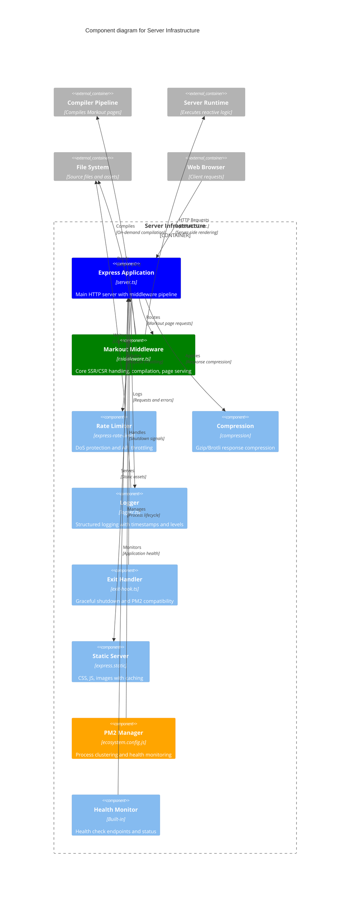

# Level 3: Server Infrastructure Components

This diagram shows the components within the Server Infrastructure container and their interactions.



## Core Server Components

### Express Application
- **HTTP Server**: Main web server handling all incoming requests
- **Middleware Pipeline**: Ordered execution of middleware components
- **Routing**: URL pattern matching and request dispatch
- **Error Handling**: Centralized error processing and recovery
- **Static Assets**: Serving CSS, JS, images with proper caching headers

**Key Features:**
- RESTful API endpoints (`/health`, `/api/*`)
- Middleware composition with proper error boundaries
- Development vs production configuration
- Request/response logging and monitoring

### Markout Middleware - Core Request Handler
- **SSR/CSR Decision**: Determines server-side vs client-side rendering approach
- **On-demand Compilation**: Compiles Markout pages only when needed
- **Caching**: Compiled page caching for performance
- **State Transfer**: Preparing server state for client hydration
- **Error Recovery**: Graceful handling of compilation and runtime errors

**Request Flow:**
1. Receive request for `.html` or Markout page
2. Check compilation cache for existing compiled version
3. Compile if needed using Compiler Pipeline
4. Execute server-side rendering with Runtime System
5. Generate HTML with embedded client runtime
6. Send pre-rendered response to browser

### Rate Limiter
- **DoS Protection**: Prevents denial-of-service attacks
- **API Throttling**: Different limits for different endpoint types
- **Client Tracking**: IP-based rate limiting with sliding windows
- **Header Information**: Rate limit status in response headers
- **Configurable Limits**: Different limits for general vs sensitive endpoints

**Rate Limiting Strategy:**
- General endpoints: 100 requests per 15 minutes
- Sensitive endpoints: 5 requests per 15 minutes
- Memory-based tracking with automatic cleanup
- Standard HTTP 429 responses when limits exceeded

## Production Infrastructure

### PM2 Process Manager
- **Cluster Mode**: Multiple Node.js processes utilizing all CPU cores
- **Health Monitoring**: Automatic restart on crashes or memory leaks
- **Zero-downtime Deployment**: Graceful reloads without service interruption
- **Log Management**: Centralized logging with rotation
- **Resource Monitoring**: CPU and memory usage tracking

**PM2 Configuration:**
```javascript
{
  name: 'markout-server',
  script: 'dist/index.js',
  instances: 'max',        // Use all CPU cores
  exec_mode: 'cluster',    // Load balancing
  max_memory_restart: '1G', // Memory leak protection
  error_file: 'logs/err.log',
  out_file: 'logs/out.log'
}
```

### Health Monitor
- **Health Check Endpoint**: `/health` endpoint for load balancer monitoring
- **Application Status**: Database connections, external service availability
- **Performance Metrics**: Response times, error rates, throughput
- **Alerting Integration**: Ready for external monitoring systems

### Exit Handler - Graceful Shutdown
- **Signal Handling**: SIGTERM, SIGINT for graceful shutdown
- **Connection Draining**: Finish processing existing requests
- **Resource Cleanup**: Close database connections, file handles
- **PM2 Compatibility**: Proper integration with PM2 restart cycles
- **Timeout Protection**: Force exit if graceful shutdown takes too long

## Supporting Components

### Logger
- **Structured Logging**: JSON format with timestamps and levels
- **Request Logging**: HTTP request/response details
- **Error Tracking**: Stack traces and error context
- **Performance Logging**: Response times and performance metrics
- **Log Rotation**: Automatic log file rotation and cleanup

**Log Levels:**
- `error`: Application errors and exceptions
- `warn`: Warning conditions and recovery
- `info`: General application information
- `debug`: Detailed debugging information (development only)

### Compression Middleware
- **Gzip/Brotli**: Automatic response compression
- **Content-Type Filtering**: Only compress appropriate content types
- **Size Threshold**: Skip compression for very small responses
- **Cache Integration**: Proper caching headers with compression

### Static File Server
- **Asset Serving**: CSS, JavaScript, images, fonts
- **Caching Headers**: Proper cache control for performance
- **ETag Support**: Conditional requests for unchanged assets
- **Content Type Detection**: Automatic MIME type detection
- **Security Headers**: Prevent content sniffing and XSS

## Security Features

### Request Security
- **Rate Limiting**: Protection against abuse and DoS attacks
- **Input Validation**: Sanitization of user inputs
- **Error Handling**: No sensitive information in error responses
- **Security Headers**: CSRF, XSS, and other security protections

### Production Hardening
- **Process Isolation**: Each PM2 worker runs in isolation
- **Memory Limits**: Automatic restart on memory leaks
- **Error Recovery**: Graceful handling of worker crashes
- **Log Security**: No sensitive data in logs

## Development vs Production

### Development Mode Features
- **Hot Reload**: Automatic server restart on file changes
- **Enhanced Logging**: Detailed debugging information
- **Error Pages**: Developer-friendly error reporting
- **Source Maps**: Better debugging experience

### Production Optimizations
- **Process Clustering**: Full CPU utilization
- **Response Caching**: Aggressive caching for performance
- **Error Handling**: User-friendly error pages
- **Security Headers**: Full security header suite
- **Log Rotation**: Automated log management

## Performance Characteristics

### Server Performance
- **Response Times**: < 50ms for cached pages, < 200ms for compilation
- **Throughput**: Thousands of requests per second with clustering
- **Memory Usage**: ~50MB per worker process
- **CPU Usage**: Efficient compilation and rendering pipeline

### Scalability
- **Horizontal Scaling**: Multiple PM2 workers per server
- **Load Balancing**: Built-in round-robin load balancing
- **Caching**: Compilation results cached in memory
- **Resource Efficiency**: Minimal overhead per request